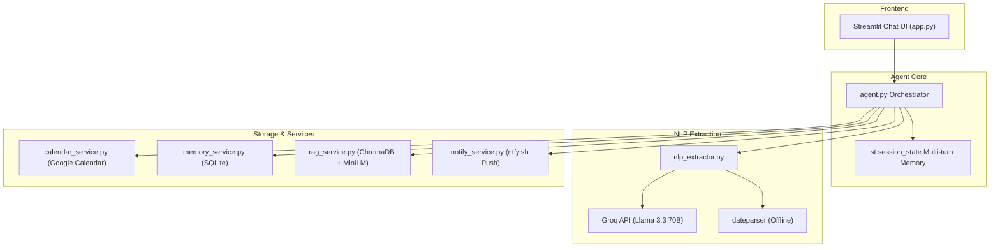

# 🗓️ AI Meeting Scheduler (100% Free-Stack Edition)

> An autonomous, GenAI-powered conversational meeting scheduler that extracts intent, resolves calendar conflicts, remembers user preferences, retrieves past meeting context via RAG, and books real events directly on Google Calendar.

**Zero paid subscriptions required.** Powered entirely by free-tier and open-source infrastructure:
- **LLM & Tool Calling:** Groq API (`llama-3.3-70b-versatile`) — Free tier: 14,400 req/day
- **Embeddings:** `sentence-transformers` (`all-MiniLM-L6-v2`) — 100% local, runs on CPU
- **Vector DB:** ChromaDB — Embedded local store, no server needed
- **Relational DB:** SQLite — Local persistence for history & preferences
- **Calendar:** Google Calendar API — Free tier OAuth2 personal integration
- **UI:** Streamlit — Modern conversational web application
- **Push Alerts (Stretch):** `ntfy.sh` — Open-source zero-cost push notification service

---

## 🏗️ Architecture & Data Flow



---

## 📁 Project Directory Structure

```
Ai-MeetingSchedular/
├── .env.example              # Environment variables template
├── .gitignore                # Protects secrets, credentials, DBs
├── requirements.txt          # Python dependencies
├── README.md                 # Setup guide and documentation
├── PROCESS_LOG.md            # Detailed log of design choices & edge-case fixes
├── app.py                    # Streamlit conversational web interface
├── agent.py                  # Agentic loop orchestrator & state manager
├── nlp_extractor.py          # Groq tool calling & dateparser integration
├── calendar_service.py       # Google Calendar OAuth2, freebusy & event creation
├── memory_service.py         # SQLite storage & preference inference
├── rag_service.py            # ChromaDB semantic search over past meetings
│
├── tests/                    # Automated unit tests
│   ├── test_nlp_extractor.py
│   ├── test_memory_service.py
│   ├── test_calendar_service.py
│   └── test_rag_service.py
│
├── stretch/                  # Stretch goals
│   ├── notify_service.py     # ntfy.sh instant push notifications
│   └── mcp_calendar_server.py # FastMCP calendar tool server
│
└── data/                     # Auto-created local data folder (gitignored)
    ├── meetings.db           # SQLite database
    └── chroma/               # ChromaDB vector index
```

---

## 🛠️ Step-by-Step Setup Guide

### Step 1: Clone Repository & Create Virtual Environment
```bash
git clone https://github.com/Shankhadeep25/Ai-MeetingSchedular.git
cd Ai-MeetingSchedular

# Create virtual environment
python -m venv venv

# Activate virtual environment
# Windows (PowerShell):
.\venv\Scripts\Activate.ps1
# Linux/Mac:
source venv/bin/activate

# Install dependencies
pip install -r requirements.txt
```

---

### Step 2: Get a Free Groq API Key (🧑 Manual)
1. Go to [console.groq.com](https://console.groq.com) and sign in for free.
2. Navigate to **API Keys** → click **Create API Key**.
3. Copy the key (starts with `gsk_...`).
4. Copy `.env.example` to `.env`:
   ```bash
   cp .env.example .env   # Or copy on Windows: copy .env.example .env
   ```
5. Open `.env` and set your key:
   ```env
   GROQ_API_KEY=gsk_your_actual_key_here
   ```

---

### Step 3: Google Calendar OAuth2 Setup (🧑 Manual)
Google Calendar API is **100% free** for personal OAuth2 use.

1. Go to [Google Cloud Console](https://console.cloud.google.com/).
2. Create a new project named `AI-Meeting-Scheduler`.
3. In the top search bar, search for **Google Calendar API** and click **Enable**.
4. Go to **APIs & Services** → **OAuth consent screen**:
   - Choose **External** → Click **Create**.
   - App name: `AI Meeting Scheduler`.
   - User support email: Select your Gmail.
   - Developer contact information: Enter your email.
   - Click **Save and Continue** through Scopes.
   - In **Test users**, add your Gmail account and save.
5. Go to **APIs & Services** → **Credentials**:
   - Click **+ Create Credentials** → **OAuth client ID**.
   - Application type: **Desktop app**.
   - Name: `AI Meeting Desktop Client`.
   - Click **Create**.
6. Click **Download JSON** for the created client ID.
7. Rename the downloaded file to `credentials.json` and place it in the root of this project folder (`Ai-MeetingSchedular/credentials.json`).

---

### Step 4: Authorize Google Calendar (One-time only)
Run the calendar service once to open your browser and generate `token.json`:
```bash
python calendar_service.py
```
- Your browser will open asking you to sign in with your Google account.
- Click **Continue** (if an "unverified app" screen appears, click **Advanced** → **Go to AI Meeting Scheduler (unsafe)**).
- Grant permission to access Google Calendar.
- The terminal will confirm: `✅ Authentication successful!`.
- `token.json` is saved locally and will automatically refresh itself.

---

### Step 5: Run the Application! 🚀

#### Option A: Streamlit Conversational Web App (Recommended)
```bash
streamlit run app.py
```
Open your browser at `http://localhost:8501`. You will see:
- Real-time conversation chat interface.
- Sidebar with your upcoming Google Calendar meetings.
- Preferences controls (timezone, default meeting duration).
- Service health badges (Groq, Google Calendar, SQLite/ChromaDB).
- Interactive quick prompt chips.
- Interactive conflict resolution buttons.

#### Option B: Terminal Mode
To test the agent directly in your command line:
```bash
python agent.py
```

---

## 🧪 Running Automated Tests

Run the test suite to verify all modules:
```bash
# Test NLP extractor and date resolution
python -m unittest tests/test_nlp_extractor.py

# Test SQLite memory and preference inference
python -m unittest tests/test_memory_service.py

# Test Calendar service freebusy and event creation logic
python -m unittest tests/test_calendar_service.py

# Test RAG service document preparation
python -m unittest tests/test_rag_service.py

# Run all tests at once
python -m unittest discover tests
```

---

## 📱 Stretch Goals

### 1. Free Push Notifications (`ntfy.sh`)
Get instant notifications on your phone whenever a meeting is booked without paid Twilio SMS:
1. In `.env`, set a unique topic:
   ```env
   NTFY_TOPIC=my-meeting-alerts-12345
   ```
2. Download the free **ntfy** app on iOS / Android or visit `https://ntfy.sh/my-meeting-alerts-12345` in your browser.
3. Every time a meeting is booked via the assistant, an instant push alert is delivered with a direct calendar link!

### 2. Model Context Protocol (MCP) Server
To use the calendar tools inside Claude Desktop, Cursor, or Antigravity via MCP:
```bash
pip install "mcp[cli]"
python stretch/mcp_calendar_server.py
```

---

## 📄 License
MIT License. Free for portfolio and educational use.
